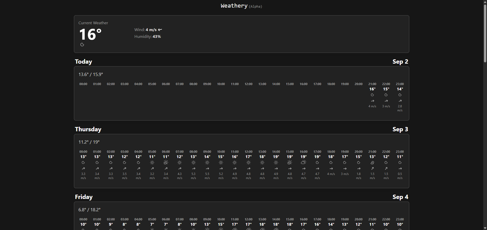
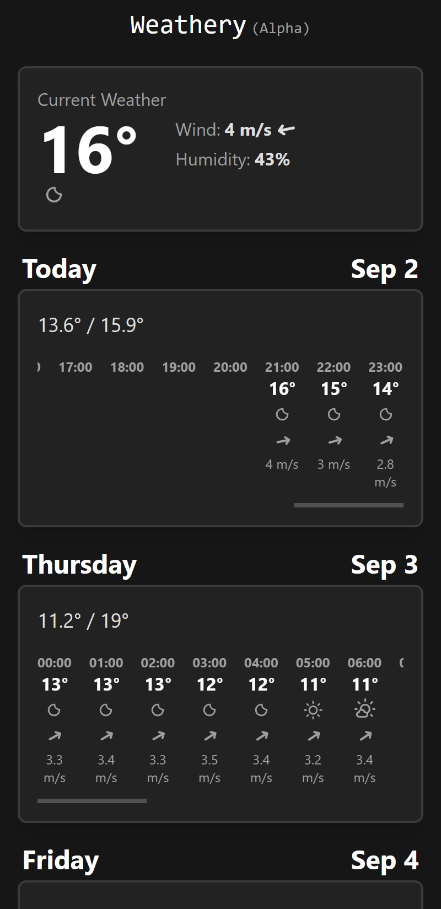

# Weather App in Next.js

This is a weather app built with Next.js with weather data retrieved from the SMHI public API. The app is optimized for mobile and desktop viewing with a dynamic TailwindCSS styling.

Check it out at [weathery-five.vercel.app](https://weathery-five.vercel.app/).

## Features

- Quick and simple view of the upcoming weather.

## Technologies Used

- React
- Next.js
- SMHI public API
- TailwindCSS
- Vercel

## Images

